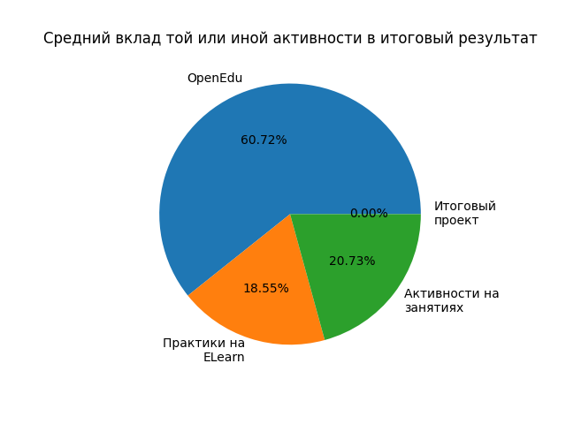
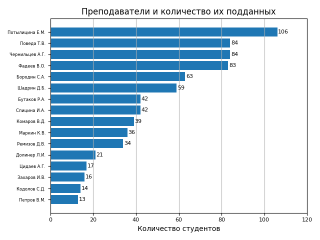

# Research Statement ― исследование ведомости УрФУ с помощью Python

Проект выполнен исключительно с целью научиться программировать на Python.

### Диаграмма количества студентов и их баллов

_Количество зелёных баллов ― на сленге студентов УрФУ, баллы, которые пойдут в бально-рейтинговую систему, в, своего рода, дневник студента._

### Средний вклад той или иной активности в итоговый результат

### Преподаватели и количество их подданных
